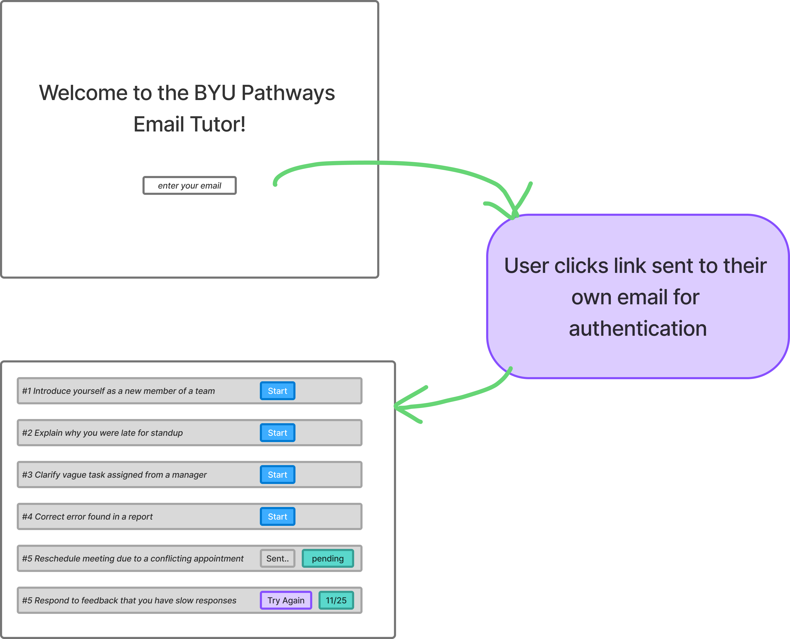

ok I am building a little student portal. Would like to make some choices between supabase and google technologies. I'm leaning towards firebase as it is likely similarly free at the lower levels and also provides a sign-in experience. Supabase provides RLS and a great way to interact client side with a database. Does firebase have that? It would be nice to have everything in the google cloud. Actually I already have the pebservice google cloud project. I wonder also if I should create a new google cloud project if I start adding things for firebase or sign-in. Is there a way to group things by organization? For free? This project should be "free" until we get like 100 customers. By free I mean free for us to run.

I'm thinking github pages would be a nice way to integrate with just some JS clientside app that interacts. I already use github and would rather not complicate things with a compute layer. Though if it were on demand and serverless it might not be too bad. I have a picture of the UI (two screens with an intermediate email login)

So a simple login flow that always sends an email with a link to the app. The link embeds the auth token which really just is a validation that they typed in the correct email. There is no email setup, but likely we will track their "scores" associated to their email. So there will be some stateful information that we will use later. Perhaps just for the student to see their progress, but could also be used to for maybe an instructor to see.

Eventually we'd want a way to launch any scenario as defined by the json's in the PEB service. We should think about the best way to integrate these together. JSON files is great, especially if they are all in the same workspace. The same repo would be even easier, but the service has it's own deployment actions and such I feel like they should be separate - but open for suggestions!!! We could have separate forlders in the same repo with more intelligent triggers, but it seems like it would get messy.

Also, with sending an email to login, I'm not sure what service would give that capability best. Supabase I heard only gives you 2 emails per day or something. Thought they seem to give you as much 2FA with email as you need. Confusing. I wonder what google offers. Also, there are other services out there that send emails. But then we'd be doing an entire service to manage this. I don't want this thing to spam other people. I think that is actually the most valuable part of requiring a password - then you only send a login email if they know their own password. Maybe we just make it easy without the password but have some sort of server side logic to not allow spamming. Spamming defined as sending many emails to the same address in rapid succession or sending emails to lots of different addresses in rapid succession from the same IP address or maybe even more intelligent where the resulting email links are not being clicked on. A computer lab in Africa may trigger an "ip-specific" throttle so wouldn't want to cause trouble. Maybe better to leave off worrying about it and just monitor it to see if it ever becomes a problem.

What are your thoughts? Maybe save them in agent_ideas.md.