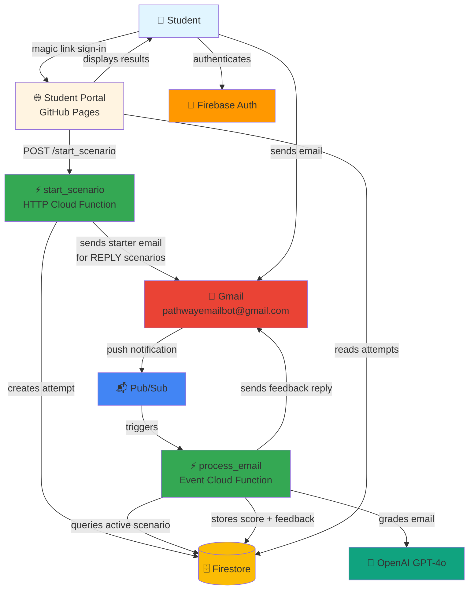
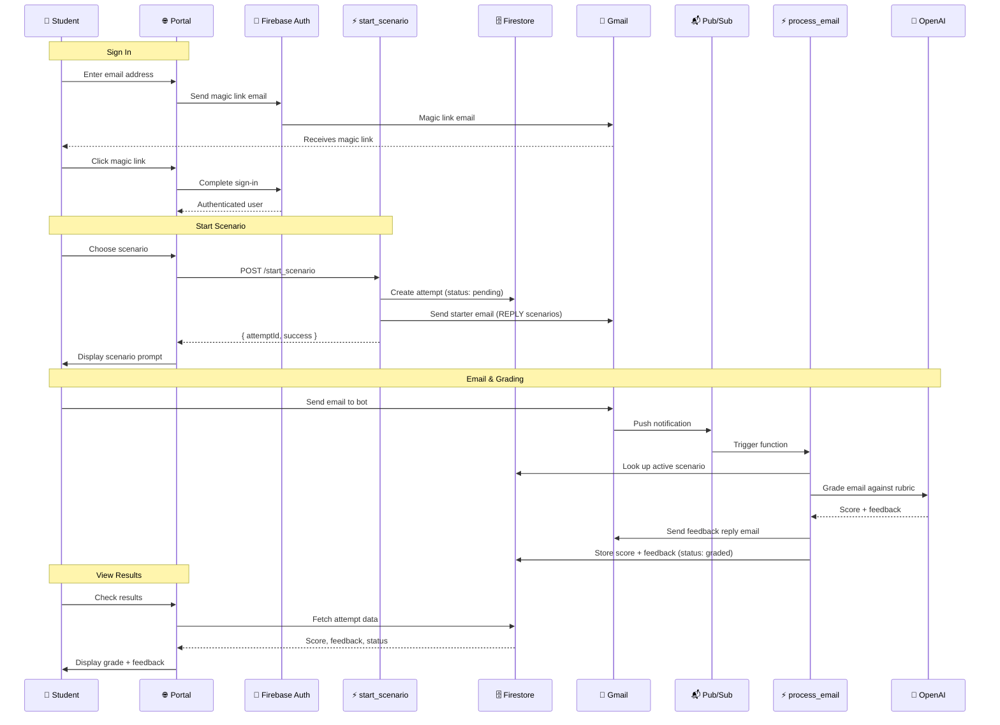

# Pathway Email Bot 📧

**An educational tool for practicing professional email communication with instant AI-powered feedback.**

> 🌐 **Live Portal**: [https://pathway-email-bot.github.io/pebservice/](https://pathway-email-bot.github.io/pebservice/)

Students choose a workplace scenario, write an email, and receive rubric-based feedback from GPT-4o — all through their real inbox.

---

## Architecture



### End-to-End Flow



---

## Tech Stack

| Component | Technology |
|-----------|-----------|
| **Backend** | Python 3.11, Google Cloud Functions (Gen 2) |
| **Frontend** | TypeScript, Vite |
| **Database** | Firestore (NoSQL) |
| **AI** | OpenAI GPT-4o |
| **Email** | Gmail API with OAuth 2.0 |
| **Messaging** | Google Cloud Pub/Sub |
| **Hosting** | GitHub Pages (Portal), Cloud Functions (Service) |
| **CI/CD** | GitHub Actions |

---

## Repository Structure

```
pebservice/
├── service/                    # Backend (Python Cloud Functions)
│   ├── main.py                # Cloud Function entry points
│   ├── gmail_client.py        # Gmail API wrapper
│   ├── email_agent/           # AI grading logic
│   └── requirements.txt
├── portal/                    # Frontend (TypeScript/Vite)
│   ├── src/
│   │   ├── components/       # UI components
│   │   ├── services/         # Firebase & API clients
│   │   └── App.tsx
│   └── package.json
├── scripts/                   # Dev & ops utilities
│   ├── setup_dev.py          # One-stop local setup
│   └── get_token.py          # OAuth token flow → Secret Manager
├── tests/
│   ├── unit/                 # Fully mocked (no GCP access)
│   ├── local/                # Against real GCP (pre-deploy)
│   └── integration/          # Against deployed system (post-deploy)
├── design_docs/              # Architecture & ops docs
│   ├── service_notes.md     # GCP resources, IAM, secrets, deployment
│   ├── architecture.md      # Design decisions, Firebase setup
│   ├── gmail_api_quota_audit.md  # Capacity planning
│   └── todo.md
├── .github/workflows/
│   ├── deploy-service.yaml   # service/** → Cloud Functions
│   └── deploy-portal.yaml    # portal/** → GitHub Pages
└── firestore.rules           # Database security rules
```

---

## Getting Started

### Prerequisites
- Python 3.11+, Node.js 18+
- Google Cloud account with access to `pathway-email-bot-6543`
- GCP CLI (`gcloud`) authenticated

### Setup

```powershell
# Clone
git clone https://github.com/pathway-email-bot/pebservice.git
cd pebservice

# Automated setup (creates venv, installs deps, pulls secrets)
python scripts/setup_dev.py

# Portal
cd portal && npm install
```

### Run Locally

```powershell
# Service unit tests (no GCP access needed)
python -m pytest tests/unit/ -v

# Portal dev server
cd portal && npm run dev

# Local tests (requires GCP credentials)
python -m pytest tests/local/ -v --timeout=30

# Integration tests (requires deployed system)
python -m pytest tests/integration/ -v --timeout=180
```

---

## Deployment

**Automatic** via GitHub Actions — push to `main` and path filters handle the rest:
- `service/**` changes → deploys Cloud Functions
- `portal/**` changes → deploys to GitHub Pages

**Manual**:
```powershell
# Deploy service (both functions need 512Mi memory)
gcloud functions deploy process_email --gen2 --region=us-central1 --runtime=python311 --source=./service --entry-point=process_email --trigger-topic=email-notifications --memory=512Mi

gcloud functions deploy start_scenario --gen2 --region=us-central1 --runtime=python311 --source=./service --entry-point=start_scenario --trigger-http --allow-unauthenticated --memory=512Mi
```

---

## Secrets

**GCP Secret Manager is the source of truth.** GitHub Secrets are a shadow copy for CI/CD.

| Secret | Purpose |
|--------|---------|
| `gmail-client-id` | OAuth Client ID |
| `gmail-client-secret` | OAuth Client Secret |
| `gmail-refresh-token-bot` | Refresh token for pathwayemailbot@gmail.com |
| `openai-api-key` | OpenAI API key for AI grading |

```powershell
# Sync secrets from GCP → local (and optionally GitHub)
python scripts/sync_secrets.py
python scripts/sync_secrets.py --github
```

> All local secret files use the `*.secret.*` naming convention and are git-ignored.

---

## Further Documentation

- **[service_notes.md](./design_docs/service_notes.md)** — GCP resources, IAM roles, Firestore schema, deployment details
- **[architecture.md](./design_docs/architecture.md)** — Design decisions, Firebase setup commands
- **[gmail_api_quota_audit.md](./design_docs/gmail_api_quota_audit.md)** — Gmail API capacity analysis and scaling options

### Related Repositories
- [michaeltreynolds/email_bot](https://github.com/michaeltreynolds/email_bot) — Original prototype (keyword-based, no AI)
- [tjkerby/email_agent](https://github.com/tjkerby/email_agent) — AI grading rubric source

---

## License

This project is open source and available for educational use.
