# Pathway Email Bot 📧

**Practice professional email communication and get instant AI-powered feedback.**

> 🌐 **Student Portal**: [https://pathway-email-bot.github.io/pebservice/](https://pathway-email-bot.github.io/pebservice/)

---

## Table of Contents
- [For Students & Educators](#-for-students--educators)
- [Architecture Overview](#-architecture-overview)
- [For Developers](#-for-developers)
- [For AI Agents](#-for-ai-agents)

---

## 👥 For Students & Educators

Pathway Email Bot is an educational tool that helps students develop professional email writing skills through practice and personalized AI-powered feedback.

### How It Works
1. **Sign up** through the [student portal](https://pathway-email-bot.github.io/pebservice/)
2. **Choose a scenario** or create your own professional email
3. **Send your email** to the practice address
4. **Receive feedback** within minutes with specific suggestions for improvement
5. **Revise and resubmit** to continue improving

### For Educators
Integrate Pathway Email Bot into your curriculum to help students:
- Practice professional communication in a safe environment
- Receive immediate, consistent feedback
- Track their progress over time
- Build confidence before real-world email interactions

📚 **Resources**: Check out the [design documentation](./design_docs) for implementation guides.

---

## 🏗️ Architecture Overview

### System Architecture

```mermaid
graph TB
    Student[👤 Student] -->|magic link sign-in| Portal[🌐 Student Portal<br/>GitHub Pages]
    Portal -->|POST /start_scenario| StartFunc[⚡ start_scenario<br/>HTTP Cloud Function]
    StartFunc -->|creates attempt| Firestore[(🗄️ Firestore)]
    StartFunc -->|sends starter email<br/>for REPLY scenarios| Gmail[📧 Gmail<br/>pathwayemailbot@gmail.com]
    
    Student -->|sends email| Gmail
    Gmail -->|push notification| PubSub[📬 Pub/Sub]
    PubSub -->|triggers| ProcessFunc[⚡ process_email<br/>Event Cloud Function]
    
    ProcessFunc -->|queries active scenario| Firestore
    ProcessFunc -->|grades email| OpenAI[🤖 OpenAI GPT-4o]
    ProcessFunc -->|sends feedback reply| Gmail
    ProcessFunc -->|stores score + feedback| Firestore
    
    Portal -->|reads attempts| Firestore
    Portal -->|displays results| Student
    Student -->|authenticates| FireAuth[🔑 Firebase Auth]
    
    style Student fill:#e1f5ff
    style Portal fill:#fff4e1
    style Gmail fill:#ea4335
    style PubSub fill:#4285f4
    style StartFunc fill:#34a853
    style ProcessFunc fill:#34a853
    style Firestore fill:#fbbc04
    style OpenAI fill:#10a37f
    style FireAuth fill:#ff9800
```



### Student Journey (End-to-End)

```mermaid
sequenceDiagram
    participant S as 👤 Student
    participant P as 🌐 Portal
    participant FA as 🔑 Firebase Auth
    participant SF as ⚡ start_scenario
    participant F as 🗄️ Firestore
    participant G as 📧 Gmail
    participant PS as 📬 Pub/Sub
    participant PE as ⚡ process_email
    participant AI as 🤖 OpenAI

    Note over S,P: Sign In
    S->>P: Enter email address
    P->>FA: Send magic link email
    FA->>G: Magic link email
    G-->>S: Receives magic link
    S->>P: Click magic link
    P->>FA: Complete sign-in
    FA-->>P: Authenticated user

    Note over S,SF: Start Scenario
    S->>P: Choose scenario
    P->>SF: POST /start_scenario
    SF->>F: Create attempt (status: pending)
    SF->>G: Send starter email (REPLY scenarios)
    SF-->>P: { attemptId, success }
    P->>S: Display scenario prompt

    Note over S,AI: Email & Grading
    S->>G: Send email to bot
    G->>PS: Push notification
    PS->>PE: Trigger function
    PE->>F: Look up active scenario
    PE->>AI: Grade email against rubric
    AI-->>PE: Score + feedback
    PE->>G: Send feedback reply email
    PE->>F: Store score + feedback (status: graded)

    Note over S,P: View Results
    S->>P: Check results
    P->>F: Fetch attempt data
    F-->>P: Score, feedback, status
    P->>S: Display grade + feedback
```



### Repository Structure

```
pebservice/
├── service/                    # Backend email processing service
│   ├── main.py                # Cloud Function entry points
│   ├── email_agent/           # AI grading logic (from tjkerby/email_agent)
│   ├── requirements.txt       # Python dependencies
│   └── .gcloudignore         # Deployment exclusions
├── portal/                    # Student-facing web application
│   ├── src/
│   │   ├── components/       # React components
│   │   ├── services/         # Firebase & API clients
│   │   └── App.tsx           # Main application
│   ├── public/               # Static assets
│   └── package.json          # Node dependencies
├── scripts/                   # Utility scripts
│   ├── auth_utils.py         # Shared OAuth utility
│   ├── get_token.py          # Interactive OAuth flow → Secret Manager
│   └── sync_secrets.py       # Secret synchronization (GCP → local/GitHub)
├── tests/                    # Test suite
│   ├── unit/                 # Pure logic tests (fully mocked)
│   ├── local/                # Tests against real GCP services (pre-deploy)
│   └── integration/          # Tests against deployed system (post-deploy)
├── design_docs/              # Architecture & planning documents
├── .github/workflows/        # CI/CD pipelines
│   ├── deploy-service.yaml   # Service deployment
│   └── deploy-portal.yaml    # Portal deployment
└── firestore.rules           # Database security rules
```

---

## 👨‍💻 For Developers

### Quick Start

1. **Clone the repository**
   ```bash
   git clone https://github.com/pathway-email-bot/pebservice.git
   cd pebservice
   ```

2. **Set up local environment**
   ```powershell
   # Install Python dependencies
   pip install -r requirements.txt
   
   # Install portal dependencies
   cd portal
   npm install
   ```

3. **Configure secrets** (see [Secret Management](#secret-management))

4. **Run locally**
   ```powershell
   # Run unit tests
   python -m pytest tests/unit/ -v
   
   # Run portal dev server
   cd portal
   npm run dev
   ```

### Technology Stack

| Component | Technology |
|-----------|-----------|
| **Backend** | Python 3.11, Google Cloud Functions (Gen 2) |
| **Frontend** | TypeScript, React, Vite |
| **Database** | Firestore (NoSQL) |
| **AI** | OpenAI GPT-4o |
| **Email** | Gmail API with OAuth 2.0 |
| **Messaging** | Google Cloud Pub/Sub |
| **Hosting** | GitHub Pages (Portal), Cloud Functions (Service) |
| **CI/CD** | GitHub Actions |

### GCP Resources

**Project**: `pathway-email-bot-6543`

| Resource | Name | Purpose |
|----------|------|---------|
| Pub/Sub Topic | `email-notifications` | Receives Gmail push notifications |
| Cloud Function | `process_email` | Core AI logic and email handler |
| Cloud Function | `start_scenario` | HTTP endpoint for starting scenarios |
| Firestore Database | `pathway` | Stores attempts and grading results |
| Secret Manager | Various | OAuth credentials and API keys |

See [service_notes.md](./service_notes.md) for complete resource documentation.

### Deployment

**Automatic deployments** via GitHub Actions:
- **Service**: Triggered on changes to `service/**` → Deploys to Cloud Functions
- **Portal**: Triggered on changes to `portal/**` → Deploys to GitHub Pages

**Manual deployment**:
```powershell
# Deploy service
gcloud functions deploy process_email --gen2 --runtime=python311 --region=us-central1 --source=./service --entry-point=process_email --trigger-topic=email-notifications

# Deploy portal
cd portal
npm run build
# Push to gh-pages branch
```

### Secret Management

**GCP Secret Manager is the source of truth**. GitHub Secrets are a shadow copy for CI/CD.

```powershell
# Sync from GCP to local dev
python scripts/sync_secrets.py

# Sync from GCP to both local and GitHub
python scripts/sync_secrets.py --github

# List all secrets in GCP
python scripts/sync_secrets.py --list
```

**Required secrets**:
- `gmail-client-id` - OAuth Client ID
- `gmail-client-secret` - OAuth Client Secret
- `gmail-refresh-token-bot` - Refresh token for pathwayemailbot@gmail.com
- `openai-api-key` - OpenAI API key

### Local Development

**Run tests**:
```powershell
# Python unit tests (no GCP access needed)
python -m pytest tests/unit/ -v

# Portal TypeScript unit tests (vitest)
cd portal; npm test

# Local tests — credential/connectivity checks against real GCP services
python -m pytest tests/local/ -v --timeout=30

# Integration tests — exercises the deployed system end-to-end
python -m pytest tests/integration/ -v --timeout=180
```

> **Note**: Gmail watch is renewed automatically by the service — no manual setup needed.

### Contributing

We welcome contributions! Please:
1. Fork the repository
2. Create a feature branch (`git checkout -b feature/amazing-feature`)
3. Commit your changes (`git commit -m 'Add amazing feature'`)
4. Push to the branch (`git push origin feature/amazing-feature`)
5. Open a Pull Request

---

## 🤖 For AI Agents

### Primary Operator Guidelines

You are the primary operator and consumer of this repository. Follow these guidelines for management and deployment:

#### Tooling & Workflow
- **Repository Management**: Use **GitHub CLI (`gh`)** for managing issues, pull requests, and repository settings
- **Secrets Management**: All sensitive information **must** be stored as **GitHub Secrets** using `gh secret set`
- **Infrastructure Management**: Use **Google Cloud CLI (`gcloud`)** or Google Cloud Console for managing GCP resources
- **Maintenance (CRITICAL)**: **You must update the resource table in `service_notes.md`** whenever a new cloud service or significant resource is added
- **Deployment**: CI/CD is handled via **GitHub Actions**. Workflows have path filters to deploy only changed components

#### Account Information
- **Owner**: michaeltreynolds@gmail.com (GCP project owner)
- **Bot Email**: pathwayemailbot@gmail.com (email that grants refresh token for service)

When asking for credentials, **always specify which account** you need credentials for.

#### Core Architecture Flow
1. **Trigger**: Email received in Gmail account (pathwayemailbot@gmail.com)
2. **Notification**: Gmail push notifications → GCP Pub/Sub topic (`email-notifications`)
3. **Processing**: Pub/Sub subscription → Cloud Function (`process_email`)
4. **AI Logic**: Cloud Function → OpenAI GPT-4o (via [email_agent](https://github.com/tjkerby/email_agent))
5. **Response**: Cloud Function → Gmail API (sends feedback to student)
6. **Storage**: Results stored in Firestore for portal display

#### Key Files to Maintain
- `service_notes.md` - **CRITICAL**: Update resource table when adding GCP resources
- `firestore.rules` - Security rules for database access
- `.github/workflows/` - CI/CD pipeline configurations
- `scripts/sync_secrets.py` - Secret synchronization tool

#### Common Tasks

**Deploy service changes**:
```powershell
# Automatic: Push to main branch with changes in service/**
git add service/
git commit -m "Update service logic"
git push origin main
```

**Update secrets**:
```powershell
# Sync from GCP Secret Manager to GitHub
python scripts/sync_secrets.py --github
```

**Gmail watch**: Automatically renewed by the service via `_ensure_watch()`. No manual renewal needed.

**Check deployment status**:
```powershell
# View recent workflow runs
gh run list

# Get function logs
gcloud functions describe process_email --gen2 --region=us-central1
```

#### Related Repositories
- **Prototype**: [michaeltreynolds/email_bot](https://github.com/michaeltreynolds/email_bot) - Initial autoresponder implementation (keyword-based, no AI)
- **AI Agent**: [tjkerby/email_agent](https://github.com/tjkerby/email_agent) - Source of rubric and feedback functionality

---

## 📄 License

This project is open source and available for educational use.

## 🔒 Privacy

All practice emails are processed securely and used only for providing feedback. See our privacy policy in the [student portal](https://pathway-email-bot.github.io/pebservice/) for details.
